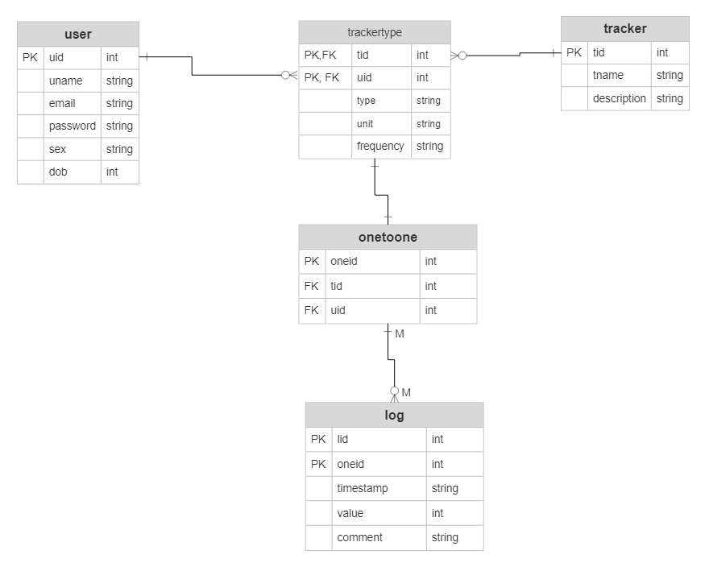

# self_tracker_app

A web app for tracking any aspect of a user's daily life.

> This project is still in development and is basically aimed at enhancing my coding skills. So there will be different versions of the same app, like:
>
> - Backend & Frontend in the same server
> - Seperate Backend & Frontend server
>
> *Will be using different frameworks for each versions*
> *Details of each versions is available in the "readme.md" file inside the curresponding directory.*

## Description

The aim of the project is to build a self-tracking app, in which user is able to track any type of parameters (Numeric, Text, Multiple choice, Rating etc) at any frequency (Hourly, Daily, Weekly, Monthly etc) according to their choice. The goal is to reduce the load on server by doing rendering of UI & UX on the client frontend. Meanwhile server should be able to do scheduled jobs or other jobs like sending user triggered emails, caching etc.

## DB Schema

This is the ER diagram of the database schema. Apart from all primary keys, *email* in **user** table and *tname* in **tracker** table is having a unique constrain. **Trackertype** table is a one-to-many relation table of user table and tracker table. This allows the user to customise any tracker based on their preferred type (Numeric, Boolean, Rating, Multiple-choice) and frequency (Hourly, Daily, Weekly, Monthly)

An additional one-to-one relation table named **onetoone** was included as it was difficult to have two foreign keys from trackertype table as primary key along with lid in log table. Value column in log table is an integer attribute. Boolean and Multiple-choice values need to be converted to corresponding numeric values for storing in the database. This is helpful not only to have a single log table, but also will be easy to change type of an existing tracker without losing data till date (e.g., A Boolean value Yes/No stored as 0/1, can be changed to Multiple choice value Good/Bad/Neutral stored as 0/1/2).
